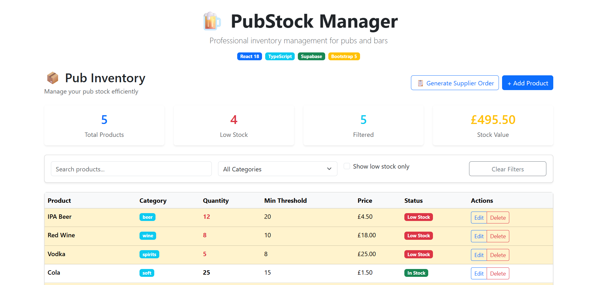
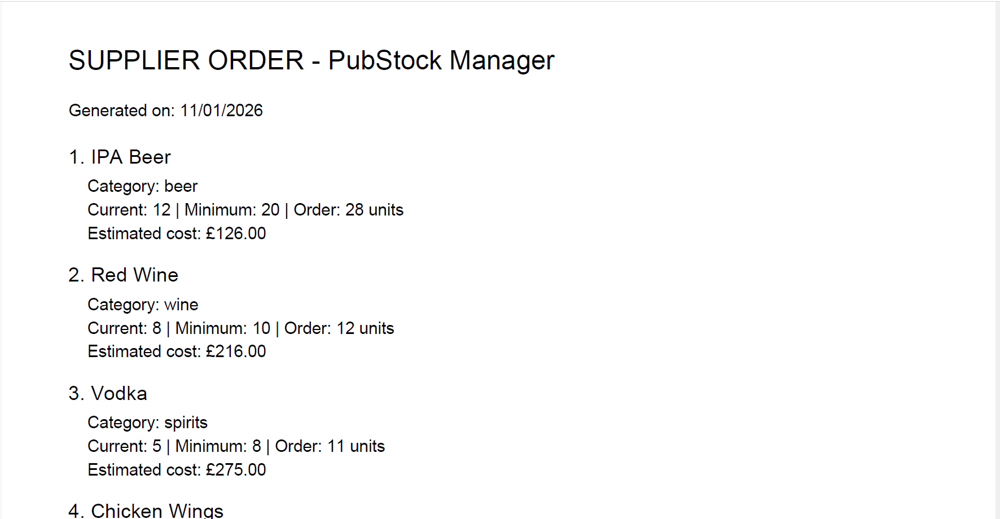
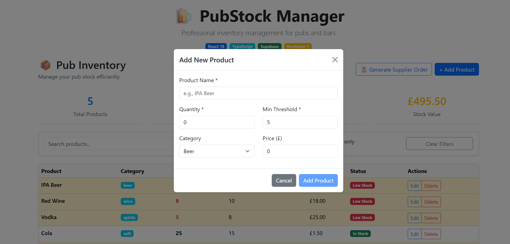

# 🍺 PubStock Manager

Professional inventory management system for pubs and bars.

## 🚀 Live Demo
**[🔗 View live](https://pubstock-manager-eo8lspaej-serena293s-projects.vercel.app/)**

## ✨ Features
- **Real-time inventory tracking** with low stock alerts
- **Full CRUD operations** for products
- **Advanced filtering & search** by category, stock status
- **PDF report generation** for supplier orders
- **Statistics dashboard** with stock value calculation
- **Responsive UI** built with Bootstrap 5

## 🛠 Tech Stack
- **Frontend:** React 18, TypeScript, Bootstrap 5
- **Backend:** Supabase (PostgreSQL, Authentication, Storage)
- **Deployment:** Vercel
- **PDF Generation:** jsPDF

## 📁 Project Structure
src/
├── components/ # React components
├── lib/ # Supabase client configuration
├── types/ # TypeScript definitions
└── utils/ # Utility functions

## 🚦 Getting Started
1. Clone repo: `git clone [git clone https://github.com/Serena293/pubstock-manager.git]`
2. Install: `npm install`
3. Set up Supabase: Create project and copy credentials to `.env`
4. Run: `npm run dev`

## 📸 Screenshots

## 🤝 Contributing
Open to suggestions and improvements!

